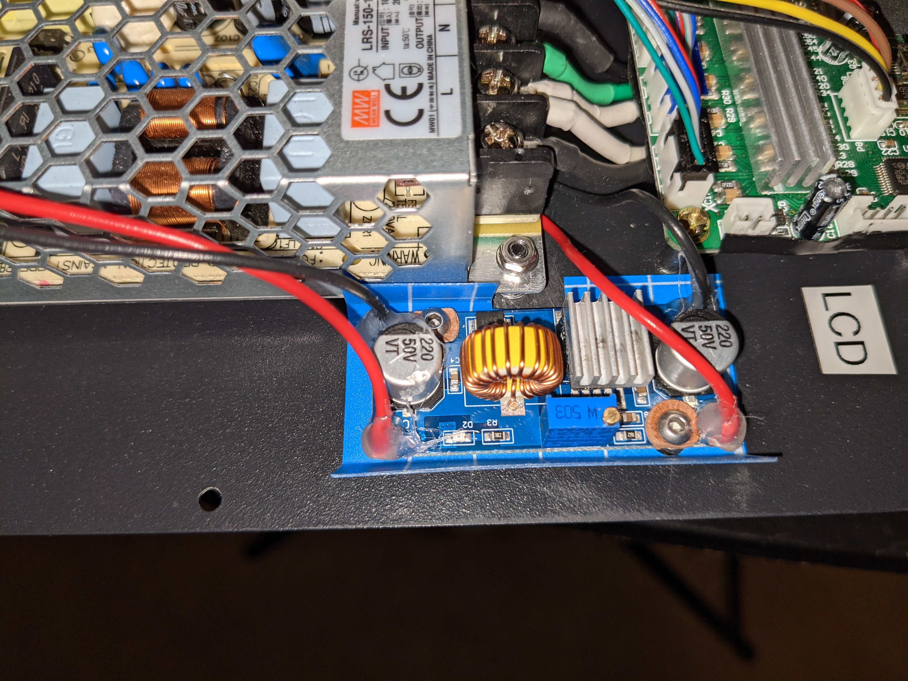

# klipper_mpsm2
FluiddPi Klipper config for Monoprice Select Mini v2

PI Zero 2 W running FluiddPI for the OS, Klipper, Fluidd, etc.

Hardware Mods

https://amazon.com/dp/B09D9DJV5V  extruder

https://thingiverse.com/thing:3731400  part cooling duct - printed in SLS by Jawstec via CraftCloud  
https://amazon.com/dp/B08T189FX2  50x15 part-cooling blower  
https://amazon.com/dp/B07PYWVPMY  40x20 heat-break fan

Chassis fan wired directly to power supply instead of controller board

Both fan headers on controller board are now used for the separate heat-break and part-cooling fans.  
Both heat-break and part-cooling fans are controllable, and the chassis fan runs all the time power is on.

https://amazon.com/dp/B018RE4CJK  meanwell 150W psu  
mounted on spacers to leave 6-8mm gap between psu and bottom plate, to let air in through the bottom grill

https://www.pishop.us/product/raspberry-pi-zero-2-w-starter-kit/  (just to get the pi zero 2w)

https://amazon.com/dp/B09BJCVYSN  ethernet & usb adapter for pi zero - not a hat, connects by pogo pins to usb contact pads, and leaves gpio header free

https://amazon.com/dp/B09PVDVQRJ  pi zero heat sink

https://amazon.com/dp/B07BDF7ZP9  step-down buck converter - 12v to 5v to power pi zero

https://amazon.com/dp/B08YN7Z9Y3  lighted blue rocker power switch for front panel

https://amazon.com/dp/B0895T9NXF  power inlet port with fuse and switch for rear panel

https://www.th3dstudio.com/product/tough-tube-high-temp-high-tolerance-ptfe-tubing/  better bowden tube

lcd & knob removed and replaced by blank plate since klipper can not use the stock lcd, also makes more room for the psu

PSU, buck converter, pi zero2w, ethernet/usb board, all mounted inside base with stock controller board

Controller connected to pi by uart from the LCD header on the controller to the GPIO UART0 pins on the pi  
just tx,rx,gnd, the 3.3v pin not connected (connector type JST-PH)  
serial console login disabled in pi config  
klippy firmware built to use USART1 (the LCD header)  
see comments in printer.cfg  

